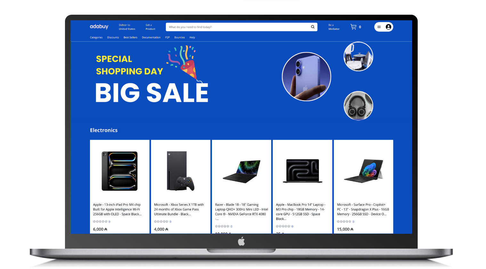
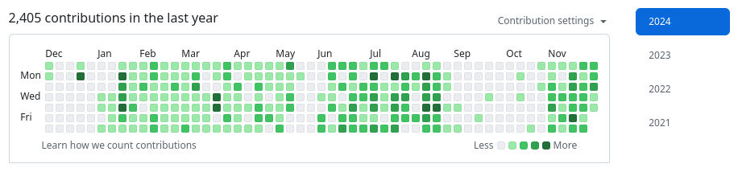

# Adabuy marketplace

Adabuy is an e-commerce protocol that uses smart contracts for the process of selling and buying physical products on Cardano using the ADA cryptocurrency.



[Whitepaper V1](z/latex/whitepaper.pdf) 👈

### Introduction

Adabuy is an electronic commerce protocol that uses smart contracts to decentralize functional requirements necessary for the processes of selling and buying a physical product. Any community member can list a product for sale and any community member can purchase the product using their Cardano wallet. The normal dynamics of an e-commerce is that the user buys a product and then receives it and in most cases this happens. But there are other cases where there is no effective delivery of the product and the conflict must be resolved.  It can be solved using blockchain hardware or by using human intermediaries (mediators). The fundamental idea behind Adabuy is to avoid the use of expensive equipment, oracles or tracking infrastructure to determine whether a product has been delivered. Instead, use mediators to resolve unsuccessful product negotiations. Binance P2P and MercadoLibre use this system to resolve dispute cases where the seller and buyer can make use of the appeal resource. To encourage users to buy from Adabuy instead of the traditional marketplace, a liquidity pool helps create discounts on best-selling products. The liquidity pool is a way to return the money from the fees to the users and sell the products cheaper with a discount. A very effective feature to compete with the traditional market that collects a large percentage of fees that are not returned to users.

### P2P trading and Mediator Scalability

Peer-to-Peer cryptocurrency exchange services such as localbitcoins or binance P2P have proven to be systems that work for secure trades. These systems are based on trust rating and involve real-world action on the part of the buyer such as making a transaction to the bank account provided by the seller. In Binance P2P, disputes between buyers and sellers can be addressed through an appeal process. Common reasons for initiating an appeal involves problems with payment confirmation, disagreements over payment quality, or disputes regarding trade terms. To protect the cryptocurrency involved in the trade an escrow system locks the funds.

Both the buyer and seller are afforded the opportunity to present evidence or explanations supporting their case during the appeal. A mediation team at Binance reviews the appeal carefully considering the evidence and arguments put forth by both parties. Subsequently, Binance reaches a decision which may involve upholding the original trade agreement, releasing funds from escrow to the appropriate party, or taking other actions based on the specific circumstances of the dispute.

[BINANCE ACTIVE USERS](https://www.binance.com/en/feed/post/2023-12-28-binance-ends-2023-with-30-user-growth-committed-to-compliance-and-web3-products-1989369934178) At the end of 2023, Binance reached approximately 170M+ registered users. A large percentage of users carry out P2P negotiations using bank accounts and physical world payment methods. Binance has demonstrated that the Peer-to-Peer exchange system with appeal mechanism is effective and scalable.

### Features


| Feature      | yes | Description                                          |
| -------------- | ----- | ------------------------------------------------------ |
| P2P          | ✓  | Cardano  preview-testnet, testnet, mainnet          |
| E2E          | ✓  | Signing and sending transactions only in the browser |
| Multi-wallet | ✓  | Nami, Lace, Eternl, VESPR                            |
| Aiken        | ✓  | Aiken validators Plutus V3                           |

### Stack


| Stack    | Type      | Description                  | Keywords                     | Version | Licence            | Repository                                                         |
| ---------- | ----------- | ------------------------------ | ------------------------------ | --------- | -------------------- | -------------------------------------------------------------------- |
| mysql    | database  | cloud-native database        | sharding                     | 8.0     | GPL license        | [https://www.mysql.com/downloads](https://www.mysql.com/downloads) |
| Debezium | cdc       | database change data capture | cdc, kafka, stream, sync     | 2.5     | Apache Version 2.0 | [https://github.com/debezium](https://github.com/debezium)         |
| Kafka    | streaming | event streaming              | high-throughput, low-latency | 3.6.1   | Apache Version 2.0 | [https://github.com/apache/kafka](https://github.com/apache/kafka) |
| Node.js  | runtime   | javascript runtime           | code, javascript             | alpine  | MIT                | [https://github.com/nodejs/node](https://github.com/nodejs/node)   |
| GraphQL  | API       | A GraphQL server can fetch data from separate sources for a single client query | query, polling, websocket | 4.11.2 | MIT | [https://github.com/apollographql/apollo-server](https://github.com/apollographql/apollo-server)
## Road Map

- [X] Add User UI
- [X] Add Seller UI
- [X] Backend
- [X] Multi-Wallet Support
  - [X] Nami
  - [X] Lace
  - [X] Eternl
- [ ] Add Blockchain Integration (In Progress)
- [ ] Add Liquidity Pool

Contributions and repository maintenance level:



## Table Of Content

[Installation](#installation)

[Documentation](#documentation)

[License](#license)

### 1\. Installation

Install kubernetes minikube (Linux x86 .deb)

https://minikube.sigs.k8s.io/docs/

```
curl -LO https://storage.googleapis.com/minikube/releases/latest/minikube_latest_amd64.deb
sudo dpkg -i minikube_latest_amd64.deb
```

```
minikube start --driver=docker --cpus="6" --memory=14gb --disk-size=200g 
```

```
minikube addons enable ingress
minikube addons enable dashboard
minikube addons enable metrics-server
```

Clone this repository in the work directory

```
git clone https://github.com/rey-sudo/core.git
```

Install skafold dev
[https://skaffold.dev/docs/install/](https://skaffold.dev/docs/install/)

```
skaffold run
```

Install kubectl

```
https://kubernetes.io/docs/tasks/tools/install-kubectl-linux
```

Command

```
sh ./setup.sh
```

```
skaffold run
```

### 2\. License

Distributed under the MIT License.

### 3\. Contact

Juan Caballero R. - sudo.delete.evil@gmail.com

GitHub: [https://github.com/rey-sudo](https://github.com/rey-sudo)

LinkedIn: [https://www.linkedin.com/in/juanrey1](https://www.linkedin.com/in/juanrey1)
